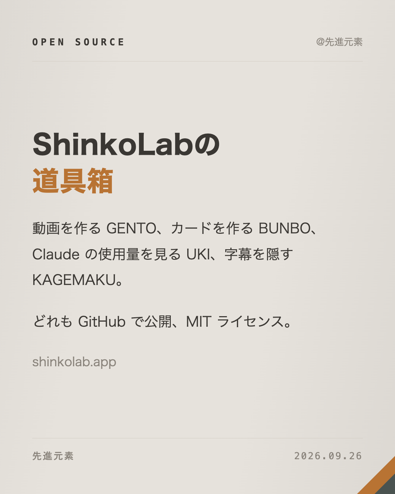

# 文房 BUNBO skill

[English](README.md) · [中文](README.zh-CN.md) · 日本語

素材ひとつ（文章、リンク、写真）から、そのまま投稿できる SNS 画像一式を作る Claude Code スキルです。

- 小紅書（RED）の長文画像：表紙、実際のフォントで測って自動改ページする本文、任意の最終ページ（1242×1656）
- Instagram カード：日本語と英語を1枚ずつ、それぞれの言語で書き下ろし（1080×1350）
- 3プラットフォーム分の投稿文とハッシュタグ
- 画像・BGM・動画の生成プロンプト、各3スタイル

文章は Claude Code が書き、決まったルール（構成、文字数、禁止表現、絵文字）で確認してから、自分のマシンでレイアウトして PNG にします。クラウド API は呼びません。
レイアウトは Web 版 [bunbo.shinkolab.app](https://bunbo.shinkolab.app) と同じものです。

制作：[ShinkoLab](https://shinkolab.app)

## サンプル

どちらも [`skills/bunbo/samples/`](skills/bunbo/samples/) のサンプル原稿からそのまま書き出したものです。

**ジン · レモン · 紙の質感**（[sample.json](skills/bunbo/samples/sample.json)）

| | | | |
|---|---|---|---|
|  |  |  |  |

**仕様書 · 赤銅 · ヘアライン**（[shinkolab.json](skills/bunbo/samples/shinkolab.json)）

| | | | |
|---|---|---|---|
|  |  |  |  |

配色、レイアウト、質感、表紙、装丁、本文テンプレート、表紙の書体は自由に組み合わせられます。一覧は [design.md](skills/bunbo/reference/design.md)。

## インストール

必要なもの：Node 20 以上、Google Chrome（Chromium、Edge も可）。中国語・日本語の書体は macOS で意図どおりに出ます。

**個人スキルとして**（コマンドは `/bunbo`）：

```bash
git clone https://github.com/Shinkou777/bunbo-skill.git
cd bunbo-skill
bash install.sh
```

**プラグインとして**（コマンドは `/bunbo:bunbo`）：

```
/plugin marketplace add Shinkou777/gento
/plugin install bunbo@shinkolab
```

## 使い方

Claude Code で `/bunbo` のあとに素材と希望を書きます。

```
/bunbo この文章を小紅書の長文画像に：<文章>
/bunbo https://example.com/some-article Instagram の日本語カードだけ
/bunbo ~/Pictures/trip/01.jpg この写真を全面の表紙にして、次の文章で：<文章>
```

リンクは本文を取得し、ログイン画面や共有文しか取れないときは止まって原文を求めます。素材が少なすぎるときも先に確認します。書いたあとはルールで確認し、画像を1枚ずつ見てはみ出しや不自然な改行がないか確かめてから渡します。

仕上がったら「短く」「書き出しを変えて」「別の切り口で」「社説レイアウトに」のように頼めば直します。

出力先は `~/Desktop/文房/<日付>-<テーマ>/`。任意の設定は `~/.config/bunbo/config.json`（`inbox`、`output`、`handle`、`credit`）。`credit` は `captions.md` の最後に任意のクレジット行を付けるかどうかで、画像には何も入れません。

## コマンドライン

```bash
node skills/bunbo/bin/bunbo.mjs fetch <url>
node skills/bunbo/bin/bunbo.mjs material <file>
node skills/bunbo/bin/bunbo.mjs check <payload.json>
node skills/bunbo/bin/bunbo.mjs render <payload.json> <outdir>
```

## ShinkoLab について

ShinkoLab は Isen の実験室です。Isen は日本と中国で AI 教育、技術研修、コンサルティングに携わり、ShinkoLab ではその講座とプロダクト、感じたことや考えたことを記録しています。

- Web サイト：[shinkolab.app](https://shinkolab.app/ja)
- 講座：[実戦塾](https://jissenjuku.shinkolab.app)、エンジニア向け・企業向けの AI 研修（詳しくは Web サイト）

ほかのオープンソース：

| ツール | 内容 |
|---|---|
| [幻燈 GENTO](https://github.com/Shinkou777/gento) | Claude Code スキル：素材からコードで描く BGM 付きショート動画 |
| [浮子 UKI](https://github.com/Shinkou777/uki) | Claude の使用量上限を表示する macOS のデスクトップ HUD |
| [影幕 KAGEMAKU](https://github.com/Shinkou777/kagemaku) | 字幕を隠す macOS のすりガラスバー。見たいときだけのぞける |

## ライセンス

MIT © @先進元素
