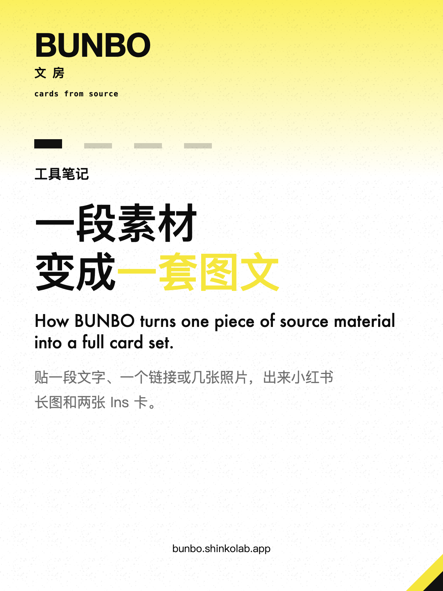
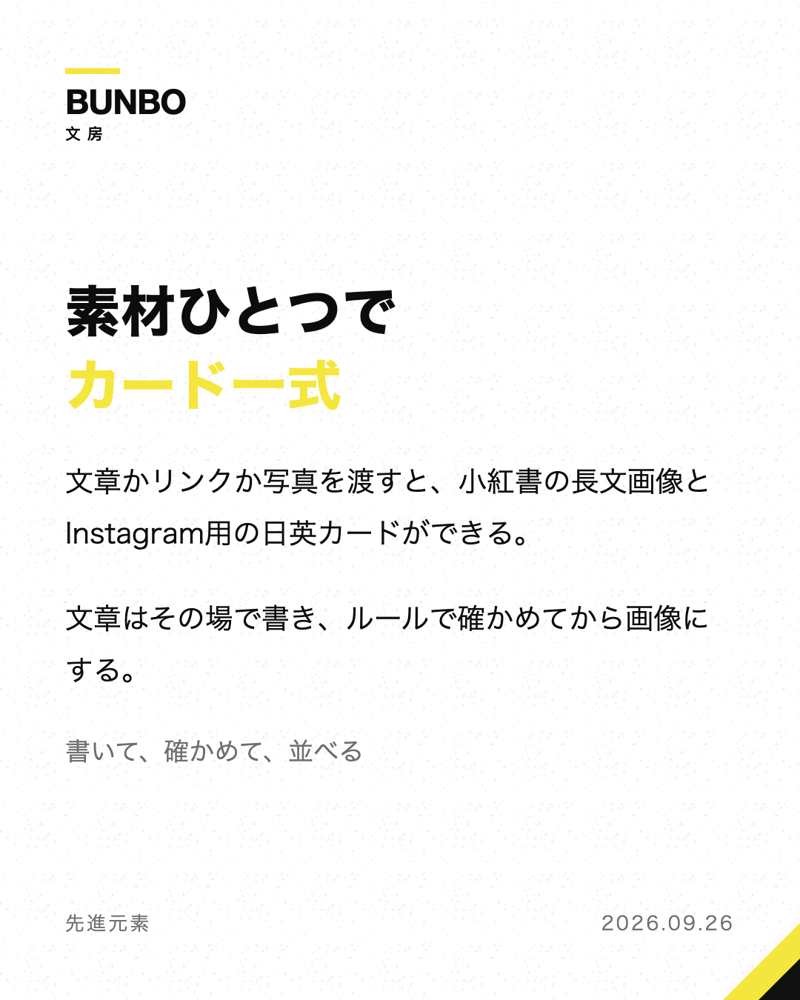
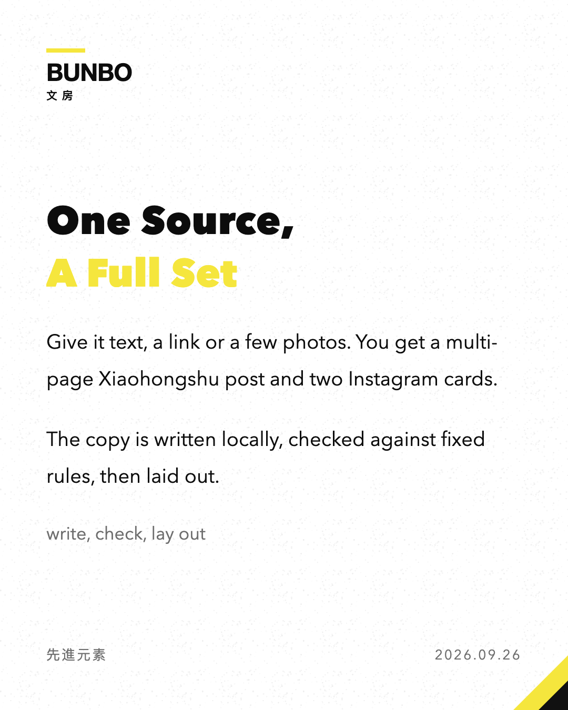

# 文房 BUNBO skill

文房は、素材ひとつから SNS 用の画像一式を作る Claude Code スキルです。

文房是一个 Claude Code skill：给一段素材，出一整套能直接发的社交图文。

BUNBO is a Claude Code skill that turns one piece of source material (text, a link, or photos) into a ready-to-post card set: a multi-page Xiaohongshu post, a Japanese Instagram card and an English Instagram card, plus captions, hashtags and image / music / video prompts. Claude Code writes the copy; a bundled checker holds it to fixed rules (structure, length limits, banned phrasings, no emoji); a bundled renderer lays it out and saves PNGs on your machine. No cloud API is called.

The layout system is the same one that runs [bunbo.shinkolab.app](https://bunbo.shinkolab.app).

| | | | |
|---|---|---|---|
|  |  |  |  |

## What you get

- **Xiaohongshu long post** (1242×1656): cover, body split into pages by measuring real text, optional closing page. Cover can be text-only, half photo, or full-bleed photo; photos can go inside the body too.
- **Instagram cards** (1080×1350): one Japanese, one English, each written natively.
- **captions.md**: post text and hashtags for all three, plus three style branches each of image, BGM and video prompts.
- **Design**: palettes, layouts, surface finishes, cover forms, binding marks, body templates and cover typefaces combine freely, with ready-made presets. The full list is in [skills/bunbo/reference/design.md](skills/bunbo/reference/design.md).

## Install

Requirements: Node 20+, Google Chrome (or Chromium / Edge). Chinese and Japanese typefaces look as intended on macOS; other systems fall back to whatever CJK fonts are installed.

**As a personal skill** (command `/bunbo`):

```bash
git clone https://github.com/Shinkou777/bunbo-skill.git
cd bunbo-skill
bash install.sh
```

The installer links `skills/bunbo` into `~/.claude/skills/bunbo`, installs `puppeteer-core`, checks for Chrome, and renders the sample as a smoke test. `git pull` updates it in place.

**As a plugin** (invoked as `/bunbo:bunbo`):

```
/plugin marketplace add Shinkou777/gento
/plugin install bunbo@shinkolab
```

## Use

```
/bunbo <paste your text, a link, or image paths>, <optional: which platforms, style, angle>
```

BUNBO fetches links (and stops if it can only get a login wall or a share blurb), counts how much real material you gave it, proposes an angle, writes the copy, runs the checker until it passes, picks a design, renders, and looks at every PNG before handing it over. Output goes to `~/Desktop/文房/YYYY-MM-DD-<slug>/`.

Optional config at `~/.config/bunbo/config.json`:

```json
{ "inbox": "/path/to/material/inbox", "output": "/path/to/output/root", "handle": "@yourname" }
```

With an inbox set, `/bunbo` with no arguments processes whatever is in it.

## The command line

The skill drives one small CLI, which you can also run by hand:

```bash
node skills/bunbo/bin/bunbo.mjs fetch <url>                    # article text, or a clear refusal
node skills/bunbo/bin/bunbo.mjs material <file>                # how much usable material there is
node skills/bunbo/bin/bunbo.mjs check <payload.json>           # structure, limits, banned phrasing
node skills/bunbo/bin/bunbo.mjs render <payload.json> <outdir> # PNGs
```

The payload format is in [skills/bunbo/reference/payload.md](skills/bunbo/reference/payload.md); a complete example is [skills/bunbo/samples/sample.json](skills/bunbo/samples/sample.json).

## About this repository

Everything here is generated from the BUNBO website's source, so the skill and the site share one set of rules and one layout system. Please open issues here; changes are made upstream and republished.

## License

MIT © @先進元素
