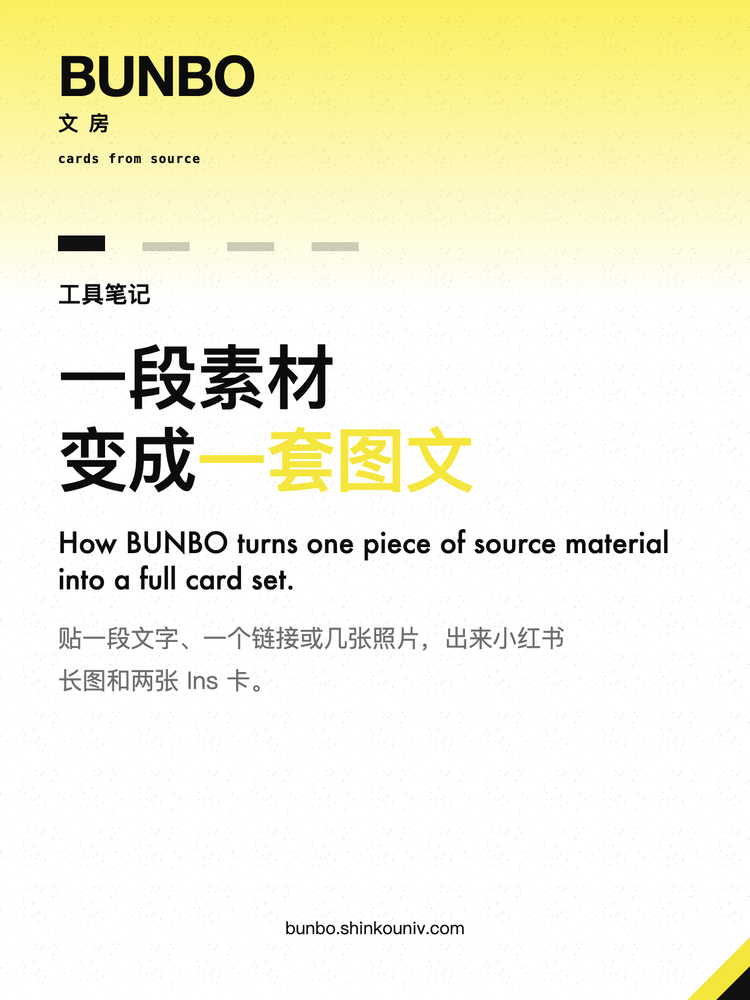
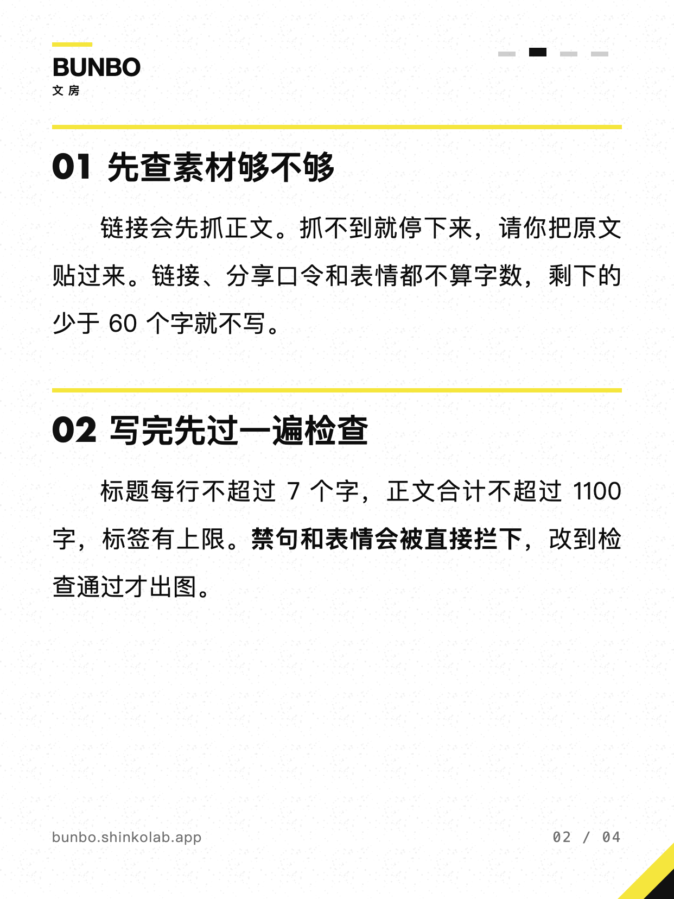
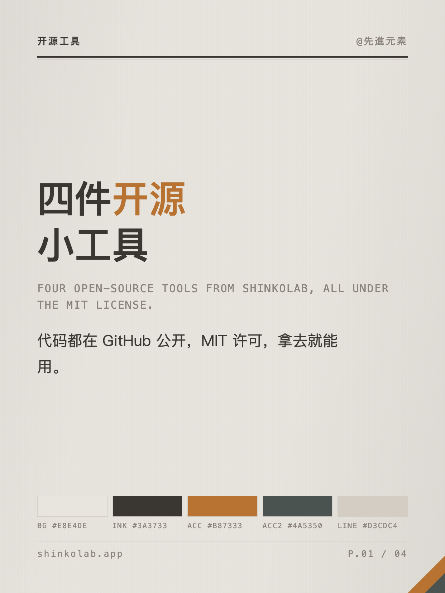
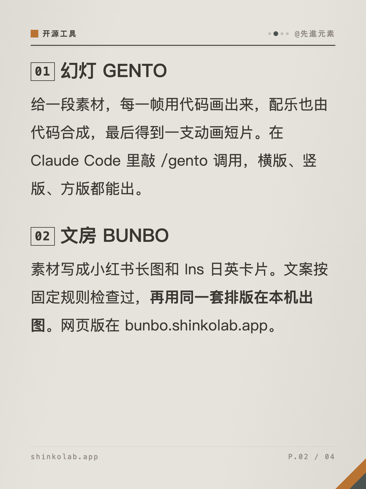
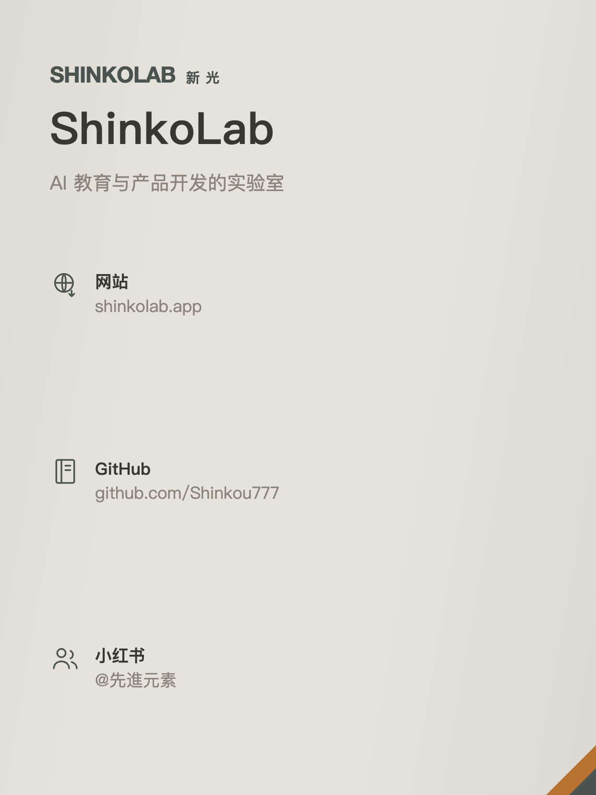
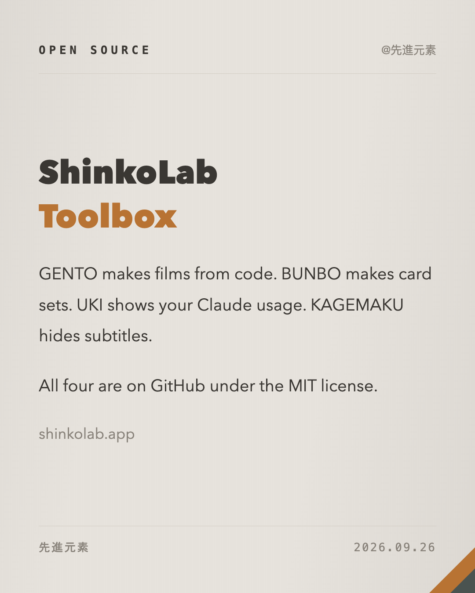

# 文房 BUNBO skill

[English](README.md) · 中文 · [日本語](README.ja.md)

一个 Claude Code skill：给一段素材（文字、链接、照片），出一整套能直接发的社交图文。

- 小红书多页长图：封面 + 按真实字体自动分页的正文 + 可选尾页，1242×1656
- Ins 日文卡、Ins 英文卡，各一张，1080×1350，按各自语言的习惯单独写
- 三个平台的发帖文案和 hashtag
- 配图、BGM、视频三类生成提示词，每类三个风格

文案由 Claude Code 写，写完用固定规则检查（结构、字数、禁句、emoji），排版和出图都在你自己的电脑上完成，不调用任何云端 API。
排版系统和网页版 [bunbo.shinkolab.app](https://bunbo.shinkolab.app) 是同一套。

出品：[ShinkoLab](https://shinkolab.app) · 小红书 [@先進元素](https://www.xiaohongshu.com/user/profile/5e493a3900000000010079b6)

## 示例

下面两套图都是用本仓库自带的示例稿直接出的，稿子在 [`skills/bunbo/samples/`](skills/bunbo/samples/)。

**刊物版式 · 柠檬配色 · 纸纹**（[sample.json](skills/bunbo/samples/sample.json)）

| | | | |
|---|---|---|---|
|  |  |  |  |

**规格书版式 · 赤铜配色 · 拉丝**（[shinkolab.json](skills/bunbo/samples/shinkolab.json)）

| | | | |
|---|---|---|---|
|  |  |  |  |

配色、版式、材质、封面、装帧、正文模板、封面字体可以自由组合，全部取值见 [design.md](skills/bunbo/reference/design.md)。

## 安装

需要：Node 20 以上，Google Chrome（Chromium、Edge 也行）。
中文、日文字体在 macOS 上效果最好；其他系统会用本机装的中日文字体代替。

**个人 skill**（命令是 `/bunbo`）：

```bash
git clone https://github.com/Shinkou777/bunbo-skill.git
cd bunbo-skill
bash install.sh
```

安装脚本会把 `skills/bunbo` 链到 `~/.claude/skills/bunbo`，装好 `puppeteer-core`，检查 Chrome，再把示例稿出一遍图当冒烟测试。
以后 `git pull` 就是更新。

**插件**（命令是 `/bunbo:bunbo`）：

```
/plugin marketplace add Shinkou777/gento
/plugin install bunbo@shinkolab
```

## 用法

在 Claude Code 里敲 `/bunbo`，后面跟素材和要求。几种常见写法：

```
/bunbo 把下面这段做成小红书长图：<粘贴一段文字>
```

```
/bunbo https://example.com/some-article 只要小红书，不要 Ins
```

```
/bunbo ~/Pictures/trip/01.jpg ~/Pictures/trip/02.jpg 配上这段话，第一张做全图封面：<文字>
```

```
/bunbo 这是我们新品的参数表，走规格书版式：<参数>
```

skill 会按这个顺序做：

1. **收素材**：链接先抓正文。抓不到（登录墙、分享口令、只有 JS 的页面）就停下来告诉你是哪条，请你把原文贴过来，不会凭标题去猜
2. **查素材量**：链接、分享口令、分享码、emoji 都不算字数。剩下的太少就先问你补料
3. **定角度**：先用一句话说这一套从哪个切入点讲
4. **写稿**：中文、日文、英文各按自己的口吻写，只用素材里有的事实
5. **检查**：结构、字数上限、禁句、emoji，不过关就改到过关
6. **选设计**：按素材挑一套版式和配色
7. **出图**：出完逐张看有没有溢出、贴边、难看的断行，有问题就改了重出
8. **收尾**：写好 `captions.md`，告诉你成品在哪

出完之后直接用中文说要怎么改就行：

```
短一点
开头换一个
换个角度再来一版
换成社论版式、素纸配色
日文卡的标题换一个
```

「短一点」这类只改说法，不加新事实；「换个角度」会拿同一份素材重写；只换设计的话文字不动，直接重出。

### 成品长这样

默认放在 `~/Desktop/文房/日期-主题/`：

```
2026-09-26-shinkolab-tools/
├── material.txt       素材原文（含抓回来的链接正文）
├── payload.json       这一套的全部文字和设计，改完可以直接重出
├── xhs_01_cover.png
├── xhs_02.png …
├── xhs_04_outro.png   尾页（有就出）
├── ins_ja.png
├── ins_en.png
└── captions.md        三个平台的发帖文案 + hashtag + 三类提示词
```

### 配置（可选）

`~/.config/bunbo/config.json`：

```json
{
  "inbox": "/素材收件箱目录",
  "output": "/成品根目录",
  "handle": "@你的署名",
  "credit": true
}
```

- 配了 `inbox`，只敲 `/bunbo` 或者说「处理 inbox」，就会把收件箱里的素材逐条做完，处理过的移到 `inbox/processed/`
- `handle` 印在封面和页脚
- `credit`：`captions.md` 最后会附一行可选署名「排版：文房 BUNBO · bunbo.shinkolab.app」，发帖时带不带你决定；设成 `false` 就不写。卡片图上不会加任何水印

## 命令行

skill 背后是一个小命令行，也可以自己直接用：

```bash
node skills/bunbo/bin/bunbo.mjs fetch <url>                    # 抓链接正文，抓不到就明说
node skills/bunbo/bin/bunbo.mjs material <文件>                 # 数素材里真正能用的字数
node skills/bunbo/bin/bunbo.mjs check <payload.json>           # 检查结构、字数、禁句、emoji
node skills/bunbo/bin/bunbo.mjs render <payload.json> <目录>    # 出图
```

payload 的格式见 [payload.md](skills/bunbo/reference/payload.md)，字段要求见 [fields.md](skills/bunbo/reference/fields.md)，口吻规则见 [voice.md](skills/bunbo/reference/voice.md)。

## 网页版

[bunbo.shinkolab.app](https://bunbo.shinkolab.app) 是同一套排版的网页版，卡片上的字可以直接点着改，还有封面、标题、词云三样工具。
网页版生成文案要填你自己的 Anthropic API key；这个 skill 用的是 Claude Code 本身，不需要单独的 key。

## 关于 ShinkoLab

ShinkoLab（新光）是 Isen 的实验室。Isen 在日本、中国从事 AI 教育、技术培训与咨询，ShinkoLab 记录这些课程、产品和所感所想。

- 网站：[shinkolab.app](https://shinkolab.app)
- 课程：[实战塾](https://jissenjuku.shinkolab.app)，以及面向在职工程师、企业团队的 AI 培训，详见网站
- 小红书：[@先進元素](https://www.xiaohongshu.com/user/profile/5e493a3900000000010079b6)
- note（日文）：[SenshinYoso](https://note.com/heishinkou)

其他开源工具：

| 工具 | 做什么 |
|---|---|
| [幻灯 GENTO](https://github.com/Shinkou777/gento) | Claude Code skill：给一段素材，用代码做出带配乐的动画短片 |
| [浮子 UKI](https://github.com/Shinkou777/uki) | macOS 桌面小浮窗，显示 Claude 的用量限额 |
| [影幕 KAGEMAKU](https://github.com/Shinkou777/kagemaku) | macOS 上的毛玻璃遮挡条，盖住视频字幕，想看再掀开 |

## 关于这个仓库

这里的文件全部由文房网站的源码生成，所以 skill 和网站用的是同一套规则、同一套排版。有问题欢迎在这里开 issue，修改会在上游完成后重新发布。

## 许可

MIT © @先進元素
